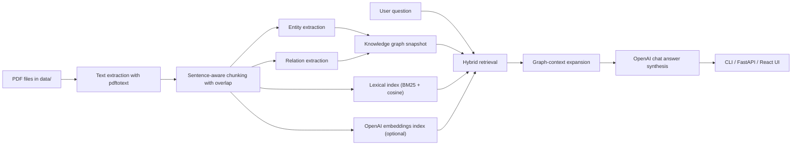

# Graphify Knowledge Graph RAG

This repository is intended to provide a baseline for hands-on practice with knowledge-graph construction, graph-aware retrieval, and retrieval-augmented generation over a local PDF corpus.

The project uses the PDFs in `data/` as the source collection, extracts technical entities and relations into a knowledge graph, builds retrieval indexes over the chunked corpus, and serves grounded answers through a FastAPI backend, a React frontend, and a CLI. The current configuration supports OpenAI for both answer generation and optional dense embeddings, with a deterministic fallback path when an API key is not present.

## What the system does

- Ingests PDFs with `pdftotext`.
- Splits documents into overlapping chunks for retrieval stability.
- Extracts entities and relations to form a graph snapshot.
- Builds a hybrid retrieval layer with lexical scoring, optional OpenAI embeddings, and graph-neighborhood boosting.
- Uses OpenAI chat generation to synthesize grounded answers from retrieved evidence and graph context.
- Exposes the workflow through CLI, FastAPI endpoints, and a React dashboard.
- Includes automated tests for chunking, extraction, retrieval, graph persistence, monitoring, and service orchestration.

## Processing pipeline



## How the graph is created

The graph-building stage is deterministic and local:

- Each PDF is converted to raw text with `pdftotext`.
- The text is split into ordered, overlapping chunks so that long technical passages remain retrievable without losing local context.
- Entity extraction uses heuristic patterns aimed at technical documents, including acronyms, title-cased concepts, and mixed-format names such as `FinRL-X`.
- Relation extraction links entities that co-occur in the same sentence and labels their relation using lightweight rule-based cues such as `introduces`, `supports`, `integrates`, and `related_to`.
- The resulting graph is stored in `artifacts/graph_snapshot.json`.

This graph is not only an output artifact; it is used during retrieval to boost chunks connected to entities present in the query.

## How retrieval works

The retrieval layer is designed to be stronger than plain keyword search:

- A lexical scorer combines BM25-style term weighting with cosine similarity over term-frequency vectors.
- If OpenAI embeddings are enabled, chunk embeddings are generated during ingestion and stored in `artifacts/chunk_embeddings.json`.
- At question time, the query can also be embedded and matched against the stored chunk embeddings.
- Entity matches in the question trigger graph-neighbor expansion, which boosts chunks connected to those entities and their relations.
- Final ranking is computed from lexical relevance, optional dense similarity, and graph-based boosting.

In practical terms, this means the retriever can combine:

- exact phrase overlap,
- semantically similar passages when embeddings are available,
- structurally related passages that matter because of the knowledge graph.

## How answers are produced

The answer path is a grounded RAG workflow:

- The retriever selects the highest-value evidence chunks.
- The graph layer adds nearby entities and relations to provide structural context.
- A prompt is built from the question, retrieved evidence, and graph context.
- The prompt is sent to the OpenAI Chat Completions API.
- By default the configuration targets `gpt-4o-mini` for answer generation and `text-embedding-3-small` for embeddings, both configurable through environment variables.
- If the OpenAI API is unavailable, the system falls back to deterministic extractive synthesis so the pipeline remains usable.

## API surface

Main backend endpoints:

- `GET /health`: liveness check.
- `GET /metrics`: lightweight operational metrics for request count, ingest count, question count, and average latency.
- `GET /api/summary`: corpus and graph summary.
- `POST /api/ingest`: builds graph and retrieval artifacts from `data/`.
- `GET /api/ask`: question answering by query parameter.
- `POST /api/chat`: question answering with a JSON payload for chatbot use.

## Repository structure

- `src/graphify_rag/`: backend package.
- `frontend/`: React + TypeScript interface.
- `tests/`: automated backend tests.
- `data/`: source PDFs used for graph building.
- `artifacts/`: generated graph and embedding artifacts.
- `main.py`: CLI entrypoint.

## Local setup

### Backend

```bash
python3 -m venv .venv
source .venv/bin/activate
pip install -r requirements.txt
pip install -e .
```

### Frontend

```bash
cd frontend
npm install
```

### Environment variables

```bash
export OPENAI_API_KEY="your-key"
export OPENAI_CHAT_MODEL="gpt-4o-mini"
export OPENAI_EMBEDDING_MODEL="text-embedding-3-small"
export USE_OPENAI_GENERATION="true"
export USE_OPENAI_EMBEDDINGS="true"
```

## Running the pipeline

### Build graph and retrieval artifacts

```bash
python main.py ingest --input-dir data --artifacts-dir artifacts
```

### Ask a question from the CLI

```bash
python main.py ask --input-dir data --artifacts-dir artifacts "What does FinRL-X emphasize about modular trading infrastructure?"
```

### Run the API

```bash
PYTHONPATH=src uvicorn graphify_rag.api.app:create_app --factory --reload
```

### Run the frontend

```bash
cd frontend
npm run dev
```

## Docker workflow

The repository includes:

- a backend `Dockerfile`,
- a frontend `frontend/Dockerfile`,
- a root `docker-compose.yml`.

To start both services:

```bash
docker compose up --build
```

The API will be available on `http://localhost:8000` and the frontend on `http://localhost:8080`.

## Testing

The backend test suite covers:

- chunking behavior,
- entity and relation extraction,
- hybrid retrieval ranking,
- graph snapshot persistence,
- monitoring metrics,
- service-level ingestion and answer generation,
- OpenAI-backed generation fallback behavior.

Run tests with:

```bash
PYTHONPATH=src python3 -m unittest discover -s tests -v
```

## Operational notes

- `pdftotext` must be installed locally unless the Docker image is used.
- Structured request logging is enabled in the API layer.
- Lightweight metrics are exposed through `/metrics`.
- Dense retrieval is optional and depends on `OPENAI_API_KEY`.

## Technology choices

- Knowledge graph: deterministic extraction over PDF chunks.
- Retrieval: hybrid BM25-style lexical search, cosine similarity, optional OpenAI embeddings, and graph-aware boosting.
- LLM: OpenAI Chat Completions API.
- Backend: FastAPI.
- Frontend: React + TypeScript with Vite.
- Packaging: `pyproject.toml` and `requirements.txt`.
