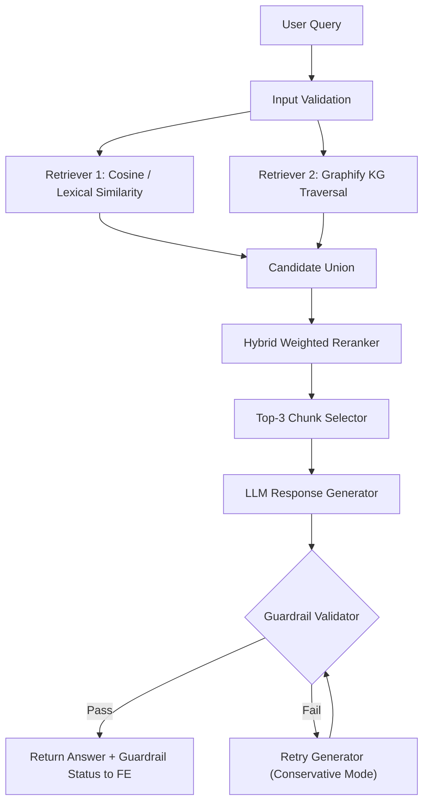

# Graphify for Knowledge Graph RAG

Graphify-first RAG platform with hybrid retrieval, weighted reranking, LLM answer generation, and guardrail validation loop.

This system is designed so each query follows a strict retrieval+validation path before returning an answer.

## Required Query Flow (Implemented)
For every user query, the pipeline executes in this order:
1. Validate query input and runtime configuration.
2. Retrieve candidate chunks using cosine/lexical similarity.
3. Retrieve candidate chunks using Graphify-based KG traversal.
4. Merge candidate sets from both retrievers.
5. Rerank using weighted hybrid scoring.
6. Select final top 3 chunks.
7. Generate answer from these top 3 chunks.
8. Validate answer with guardrails.
9. If guardrail passes, return answer + status to FE.
10. If guardrail fails, loop back to response generation (bounded retries).

## Architecture Diagram


## How Retrieval Works
### Retriever 1: Cosine / Lexical Retrieval
- Builds lexical relevance from chunk corpus.
- Computes similarity between query and chunks.
- Returns top lexical candidates.

### Retriever 2: KG Traversal Retrieval
- Uses Graphify-derived entities and relations (or deterministic fallback graph).
- Maps query entities to graph nodes.
- Traverses neighbors to identify structurally relevant chunks.
- Returns top KG candidates.

### Hybrid Weighted Reranking
Final chunk score combines both retrievers plus entity overlap:

`final_score = w_lexical * lexical_score + w_kg * kg_score + w_entity * entity_overlap`

Default behavior prioritizes chunks that:
- are semantically similar to the query,
- are structurally relevant in the KG,
- contain more overlapping query entities.

Final context policy:
- highest-ranked top 3 chunks are used for answer generation.

## Guardrails and Validation Loop
After generation, answer validation enforces safety and quality checks:
- response completeness checks
- grounding checks against retrieved evidence
- hallucination/unsupported-claim guardrails
- configurable retry loop for regeneration

If validation fails:
- the system does **not** return immediately,
- it re-enters generation with stricter constraints,
- FE receives final guardrail result (`passed`, reason, attempts).

## Production-Level Capability Analysis
### Implemented
- Graphify-first ingestion with fallback extractor.
- Hybrid retrieval (lexical/cosine + KG traversal).
- Weighted reranking and top-k selection.
- LLM answer synthesis with guardrail validation loop.
- FastAPI backend endpoints (`/health`, `/metrics`, `/api/summary`, `/api/ingest`, `/api/ask`, `/api/chat`).
- React frontend for query/response interaction.
- Service-level tests for ingestion, retrieval, and answer generation.
- Dockerized backend + frontend with docker-compose.
- Monitoring metrics endpoint and structured logging.

### Validation and Guardrails
- Query and payload validation in API and service layers.
- Configurable guardrail retries (`MAX_GUARDRAIL_RETRIES`).
- Fallback behavior when OpenAI or Graphify is unavailable.
- Persisted artifacts for auditability (`graph_snapshot`, embeddings, metadata).

### Gaps to Address for Enterprise Production
- Authentication + authorization for API endpoints.
- Rate limiting and abuse prevention.
- Persistent vector DB / graph DB backend (current artifacts are file-based).
- End-to-end evaluation suite for faithfulness and retrieval quality.
- Prompt/version registry and model governance controls.

## Repository Structure
- `src/graphify_rag/`: backend package and service orchestration.
- `src/graphify_rag/retrieval.py`: hybrid retrieval and scoring.
- `src/graphify_rag/service.py`: ingest + query pipeline + guardrail loop.
- `src/graphify_rag/graphify_adapter.py`: Graphify integration.
- `frontend/`: React + TypeScript user interface.
- `tests/`: automated backend tests.
- `data/`: source PDFs.
- `artifacts/`: generated KG/retrieval artifacts.
- `main.py`: CLI entrypoint.

## Setup
### Backend
```bash
python3 -m venv .venv
source .venv/bin/activate
pip install -r requirements.txt
pip install -e .
```

### Frontend
```bash
cd frontend
npm install
```

### Environment Variables
```bash
export OPENAI_API_KEY="your-key"
export OPENAI_CHAT_MODEL="gpt-4o-mini"
export OPENAI_EMBEDDING_MODEL="text-embedding-3-small"
export USE_OPENAI_GENERATION="true"
export USE_OPENAI_EMBEDDINGS="true"
export PREFER_GRAPHIFY="true"
export ENABLE_LLM_GUARDRAILS="true"
export MAX_GUARDRAIL_RETRIES="2"
```

## Run
### Build artifacts
```bash
python main.py ingest --input-dir data --artifacts-dir artifacts
```

### Ask from CLI
```bash
python main.py ask --input-dir data --artifacts-dir artifacts "What are the key KG retrieval stages?"
```

### Run API
```bash
PYTHONPATH=src uvicorn graphify_rag.api.app:create_app --factory --reload
```

### Run frontend
```bash
cd frontend
npm run dev
```

## Docker
```bash
docker compose up --build
```

## Tests
```bash
PYTHONPATH=src python3 -m unittest discover -s tests -v
```

## Test Strategy
The test suite is designed around the most failure-prone areas of a Graphify + hybrid-RAG system:
- ingestion correctness (Graphify path and deterministic fallback path)
- retrieval correctness (lexical/cosine, KG traversal, and hybrid ranking behavior)
- generation orchestration (context packaging and retry behavior)
- guardrail control flow (pass/fail conditions and bounded retry loop)
- service/API behavior (ingest lifecycle, ask/chat endpoints, summary and metrics consistency)

Testing is intentionally layered:
- unit tests for retrieval, graph parsing, extraction, and scoring logic
- service tests for end-to-end ingest + answer flow with deterministic assertions
- API tests for request/response contracts and runtime health behavior

This approach keeps algorithmic regressions and integration regressions visible separately.
