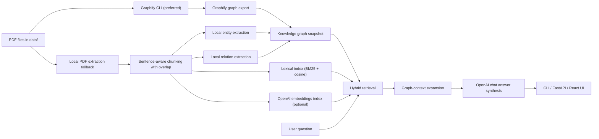

# Graphify Knowledge Graph RAG

This repository is intended to provide a baseline for hands-on practice with Graphify-driven knowledge-graph construction, graph-aware retrieval, and retrieval-augmented generation over a local PDF corpus.

The project uses the PDFs in `data/` as the source collection, prefers Graphify to build the knowledge graph, layers hybrid retrieval over the resulting corpus artifacts, and serves grounded answers through a FastAPI backend, a React frontend, and a CLI. OpenAI is used for answer generation and optional dense retrieval embeddings. If Graphify is not installed, the repository falls back to a local deterministic graph-building pipeline so the system remains usable.

## What the system does

- Runs Graphify over the corpus when the `graphify` CLI is available.
- Falls back to the local PDF extraction and graph-construction pipeline when Graphify is unavailable.
- Builds a graph snapshot of documents, chunks, entities, and relations.
- Uses hybrid retrieval with lexical scoring, optional OpenAI embeddings, and graph-neighbor boosting.
- Uses OpenAI chat generation to synthesize grounded answers from retrieved evidence plus graph context.
- Exposes the workflow through CLI, FastAPI endpoints, and a React dashboard.
- Includes automated tests for Graphify parsing, fallback ingestion, retrieval, graph persistence, monitoring, and service behavior.

## Processing pipeline



## How Graphify fits into the repository

The repository now has two graph-construction paths:

- Preferred path: Graphify is invoked against the source folder, and its exported `graph.json` is parsed into the application snapshot.
- Fallback path: if Graphify is unavailable or fails, the repository uses the local deterministic extractor already included in `src/graphify_rag/`.

The Graphify integration is implemented in [src/graphify_rag/graphify_adapter.py](/Users/dev/Documents/Graphify_for_Knowledge_Graph_RAG/src/graphify_rag/graphify_adapter.py). The service layer in [src/graphify_rag/service.py](/Users/dev/Documents/Graphify_for_Knowledge_Graph_RAG/src/graphify_rag/service.py) prefers Graphify automatically when `PREFER_GRAPHIFY=true` and the `graphify` command is available.

When Graphify runs successfully:

- the source folder is passed to the Graphify CLI,
- the Graphify export is normalized into internal `documents`, `chunks`, `entities`, and `relations`,
- a Graphify manifest is written under `artifacts/`,
- the API summary reports `graph_provider: "graphify"`.

When Graphify is unavailable, the API summary reports the fallback provider and the local extraction pipeline is used instead.

## How the fallback graph is created

If Graphify is not present, the local graph-building stage is deterministic:

- Each PDF is converted to raw text with `pdftotext`.
- The text is split into ordered, overlapping chunks so that long technical passages remain retrievable without losing local context.
- Entity extraction uses heuristic patterns aimed at technical documents, including acronyms, title-cased concepts, and mixed-format names such as `FinRL-X`.
- Relation extraction links entities that co-occur in the same sentence and labels their relation using lightweight rule-based cues such as `introduces`, `supports`, `integrates`, and `related_to`.
- The resulting graph is stored in `artifacts/graph_snapshot.json`.

Whether the graph comes from Graphify or the fallback path, it is not just an output artifact. It is also used during retrieval to boost passages connected to matched query entities.

## How retrieval works

The retrieval layer is designed to be stronger than plain keyword search:

- A lexical scorer combines BM25-style term weighting with cosine similarity over term-frequency vectors.
- If OpenAI embeddings are enabled, chunk embeddings are generated during ingestion and stored in `artifacts/chunk_embeddings.json`.
- If Graphify produced the graph, the retriever operates over Graphify-derived entities and relations. Otherwise it uses the locally extracted graph.
- At question time, the query can also be embedded and matched against the stored chunk embeddings.
- Entity matches in the question trigger graph-neighbor expansion, which boosts chunks connected to those entities and their relations.
- Final ranking is computed from lexical relevance, optional dense similarity, and graph-based boosting.

In practical terms, the retriever combines:

- exact lexical overlap,
- semantic similarity when embeddings are available,
- structural relevance from the knowledge graph.

## How answers are produced

The answer path is a grounded RAG workflow:

- The retriever selects the highest-value evidence chunks.
- The graph layer adds nearby entities and relations to provide structural context.
- A prompt is built from the question, retrieved evidence, and graph context.
- The prompt is sent to the OpenAI Chat Completions API.
- By default the configuration targets `gpt-4o-mini` for answer generation and `text-embedding-3-small` for embeddings.
- If the OpenAI API is unavailable, the system falls back to deterministic extractive synthesis.

## API surface

Main backend endpoints:

- `GET /health`: liveness check.
- `GET /metrics`: lightweight operational metrics for request count, ingest count, question count, and average latency.
- `GET /api/summary`: corpus summary, graph summary, and graph provider.
- `POST /api/ingest`: builds graph and retrieval artifacts from `data/`.
- `GET /api/ask`: question answering by query parameter.
- `POST /api/chat`: question answering with a JSON payload for chatbot use.

## Repository structure

- `src/graphify_rag/`: backend package.
- `frontend/`: React + TypeScript interface.
- `tests/`: automated backend tests.
- `data/`: source PDFs used for graph building.
- `artifacts/`: generated graph and embedding artifacts.
- `main.py`: CLI entrypoint.

## Local setup

### Backend

```bash
python3 -m venv .venv
source .venv/bin/activate
pip install -r requirements.txt
pip install -e .
```

### Frontend

```bash
cd frontend
npm install
```

### Environment variables

```bash
export OPENAI_API_KEY="your-key"
export OPENAI_CHAT_MODEL="gpt-4o-mini"
export OPENAI_EMBEDDING_MODEL="text-embedding-3-small"
export USE_OPENAI_GENERATION="true"
export USE_OPENAI_EMBEDDINGS="true"
export PREFER_GRAPHIFY="true"
```

### Graphify installation note

To use the preferred graph-construction path, install the Graphify CLI separately and make sure the `graphify` command is available on your shell `PATH`. If Graphify is not installed, the repository still works, but it will use the local fallback pipeline instead.

## Running the pipeline

### Build graph and retrieval artifacts

```bash
python main.py ingest --input-dir data --artifacts-dir artifacts
```

### Ask a question from the CLI

```bash
python main.py ask --input-dir data --artifacts-dir artifacts "What does FinRL-X emphasize about modular trading infrastructure?"
```

### Run the API

```bash
PYTHONPATH=src uvicorn graphify_rag.api.app:create_app --factory --reload
```

### Run the frontend

```bash
cd frontend
npm run dev
```

## Docker workflow

The repository includes:

- a backend `Dockerfile`,
- a frontend `frontend/Dockerfile`,
- a root `docker-compose.yml`.

To start both services:

```bash
docker compose up --build
```

The API will be available on `http://localhost:8000` and the frontend on `http://localhost:8080`.

## Testing

The backend test suite covers:

- Graphify graph parsing,
- fallback chunking behavior,
- entity and relation extraction,
- hybrid retrieval ranking,
- graph snapshot persistence,
- monitoring metrics,
- service-level ingestion and answer generation,
- OpenAI-backed generation fallback behavior.

Run tests with:

```bash
PYTHONPATH=src python3 -m unittest discover -s tests -v
```

## Operational notes

- `pdftotext` must be installed locally unless the Docker image is used.
- The `graphify` command must be installed if you want Graphify-backed KG generation instead of the fallback extractor.
- Structured request logging is enabled in the API layer.
- Lightweight metrics are exposed through `/metrics`.
- Dense retrieval is optional and depends on `OPENAI_API_KEY`.

## Technology choices

- Knowledge graph: Graphify-backed when available, deterministic fallback otherwise.
- Retrieval: hybrid BM25-style lexical search, cosine similarity, optional OpenAI embeddings, and graph-aware boosting.
- LLM: OpenAI Chat Completions API.
- Backend: FastAPI.
- Frontend: React + TypeScript with Vite.
- Packaging: `pyproject.toml` and `requirements.txt`.
